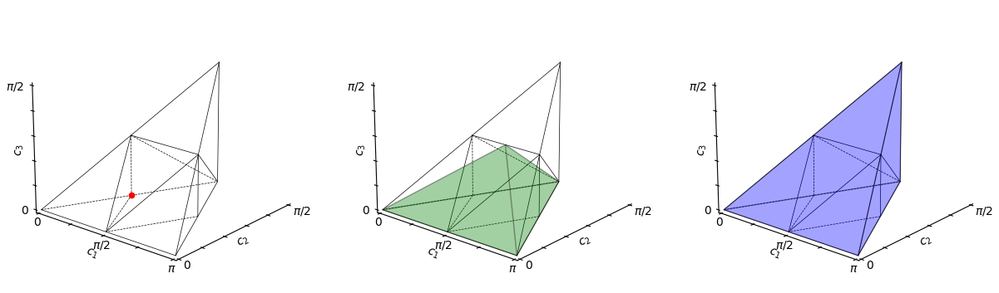
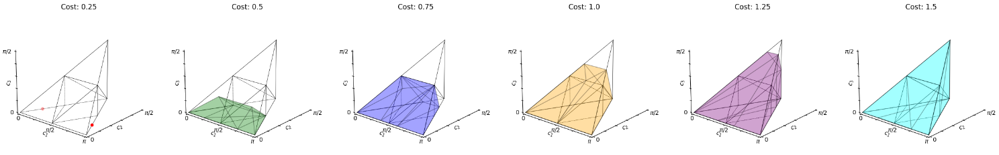
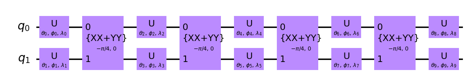

# `monodromy`

Computations in the monodromy polytope for quantum gate sets.

## Fork

#### This fork is focused on wrapping functions to be more easily integrated with Qiskit circuits.

Change log:

1. Modification to python packing, for ease of use.
2. Created a combined consolidation and depth analysis into a Qiskit AnalysisPass.
   The original work was conducted in the [Pitt-JonesLab/slam_decomposition](https://github.com/Pitt-JonesLab/slam_decomposition) repository. This repository is a cleaner, more focused implementation of the key ideas, avoiding the complexities found in the original [polytope_wrap.py](https://github.com/Pitt-JonesLab/slam_decomposition/blob/main/src/slam/utils/polytopes/polytope_wrap.py) file.
3. Simple utilities for easier gate Haar scores, coverage set building/plotting
4. CircuitPolytopes now include instruction data instead of just operation strings

---

Simple function for gate Haar scores:

```python
from monodromy.haar import gates_to_haar
from qiskit.circuit.library import CXGate, iSwapGate

print(gates_to_haar(CXGate())) #3.000000000000001
print(gates_to_haar(CXGate().power(1/2))) #3.540254820808027
print(gates_to_haar(iSwapGate())) #3.000000000000001
print(gates_to_haar(iSwapGate().power(1/2))) #2.2098826363156774
```

Plotting coverage volumes:

```python
from monodromy.render import gates_to_coverage_plot
gates_to_coverage_plot(iSwapGate().power(1/2), overlap=False)
```



Example with overcomplete basis set:

```python
U = iSwapGate().power(1 / 2)
U2 = iSwapGate().power(1 / 4)
coverage = gates_to_coverage_plot(U, U2, costs=[0.5, 0.25])
```



Previously, `CircuitPolytopes` only tracked strings for operation names. Modification tracks the actual `Instruction` objects, allowing for coverage set lookup to return parameterized quantum circuits for decomposition purposes.

```python
target = UnitaryGate(canonical_gate(0.5, 0.25, 0.25))
target_build_ansatz(coverage_set=coverage, target=target).draw('mpl')
```



Other helpful functions:

```python
from monodromy.coverage import gates_to_coverage, coverage_lookup_operation
gates_to_coverage(*gates:Instruction, costs=None, sort = False) -> List[CircuitPolytope]
coverage_lookup_operation(coverage_set:List[CircuitPolytope], target: Instruction) -> (float, List)
```

---

A helpful transpiler subroutine implemented as a Qiskit `AnalysisPass` named MonodromyDepth located in [monodromy/depthPass.py](src/monodromy/depthPass.py), designed to determine the depth (or cost) of a quantum circuit without the need for explicit decomposition.

The implemented procedure, given a set of basis gates, performs the following steps:

1. Consolidates unitary blocks within the circuit.
2. Looks up the cost of the consolidated circuit using the monodromy polytope.
3. Returns the length of the longest path within the circuit, where the length is determined by the decomposition cost.

Here's an example of how to use `MonodromyDepth`:

```python
from monodromy.depthPass import MonodromyDepth
from qiskit.transpiler.passmanager import PassManager
from qiskit.circuit.library import iSwapGate
from qiskit.transpiler.passes import Depth
from qiskit import QuantumCircuit

pm = PassManager()
pm.append(Depth())
pm.append(MonodromyDepth(basis_gate=iSwapGate().power(1/2)))

qc= QuantumCircuit(4)
qc.swap(0,1)
qc.cx(0,1)
qc.cx(1,2)
qc.swap(0,1)
display(qc.draw())

pm.run(qc)
expected_value = 14
print(f"Depth: {pm.property_set['depth']}")
print(f"Monodromy depth: {pm.property_set['monodromy_depth']}")
assert pm.property_set["monodromy_depth"] == expected_value, "Monodromy depth not calculated correctly!"
```

```bash
q_0: ─X───■────────X─
      │ ┌─┴─┐      │
q_1: ─X─┤ X ├──■───X─
        └───┘┌─┴─┐
q_2: ────────┤ X ├───
             └───┘
q_3: ────────────────

Depth: 4
Monodromy depth: 7.0
```

In this example, the QuantumCircuit `qc` is analyzed using the `MonodromyDepth` with `CXGate` as the basis gate. The PassManager `pm` runs the circuit, and the computed depth is compared against an expected value. Confirms that using this pass is key to recognizing the changing cost of depth post-decomposition.

## Overview

[Fixed-Depth Two-Qubit Circuits and the Monodromy Polytope](https://arxiv.org/abs/1904.10541) described a technique for determining whether a given two-qubit unitary can be written as a circuit with a prescribed sequence of two-qubit interactions, interleaved with arbitrary single-qubit unitaries.
This python package is a computationally effective implementation of that technique.

## Installation

1. This package comes with a `requirements.txt` file.
   Begin by installing those requirements, using `pip -r requirements.txt`.
2. Install [`lrs`](http://cgm.cs.mcgill.ca/~avis/C/lrs.html).
   Typically, this means downloading the source, building it, and placing the generated executable somewhere in the search path for your python process.
   **NOTE:** We require either version ≥0.7.2 _or_ version ≥0.7.1 of `lrsgmp` (renamed to `lrs`).
3. _Optionally,_ install [`lrcalc`](https://sites.math.rutgers.edu/~asbuch/lrcalc/). Typically, this means downloading the source, building it, then building the Cython bindings, and installing the resulting package. _This is not necessary: `lrcalc` is needed only for the curious user who wants to regenerate the contents of `qlr_table.py`._

## Configuration

If you're unable to put `lrs` in your search path, you can specify its location via the environment variable `LRS_PATH`.

## Usage

Give it a whirl with `scripts/demo.py`.

## Notes

We've designed the package around polytopes with rational coordinates.
In practice this suits the use cases of quantum computer scientists fine, but it is easy to imagine use cases outside of this.
`lrs` makes strong assumptions about the kind of arithmetic used, so if one were to want to process irrational polytopes, one would be obligated to move away from `lrs`.

`lrs` is licensed under GPLv2, which makes it insuitable for inclusion in some projects.
We may someday want to remove (or make optional) this dependency from this project.
To this end, we have set up a `backend` which describes a contained and minimal set of calls we make of any computational library.
